# Design of Beam-Splitter

**Author:** Amirali Ekhteraei
**Date:** June 18, 2026

> Converted from the uploaded PDF report. Figures are included from the provided image folder.

## Introduction

The objective of this work is to design, simulate, and layout a silicon photonic four-port beam
splitter suitable for operation in the telecom wavelength range. The design flow starts from the
photonic platform assumptions, proceeds through single-waveguide and coupled-waveguide modal
analysis, and ends with an automated GDS layout generation and electromagnetic verification
workflow. The final goal is to obtain a set of directional couplers with different gaps and coupling
lengths, identify the geometries that provide near-50/50 splitting, and integrate them into a testable
chip layout with grating-coupler access structures.
We first define the assumed fabrication platform and material stack. The nominal platform is
a silicon-on-insulator process with a silicon device layer of thickness
tSi = 220 nm,
a buried oxide layer, and silicon dioxide upper cladding. The operating wavelength range is chosen
to be approximately
1500 nm ≤ λ ≤ 1600 nm,
with particular emphasis on the region around 1550 nm. Within this wavelength range, the dispersive refractive indices of silicon and silicon dioxide are first evaluated and used consistently in
the mode solver, supermode solver, and FDTD simulations. These platform assumptions define the
waveguide cross-section, the optical confinement, and the expected fabrication constraints for the
directional coupler. The main platform and design specifications used throughout the design flow
are summarized in Table 1.
**Python scripts and dataset:** https://github.com/AmiEkh/Flexcompute-Hackathon

**Table 1: Target platform and design specifications for the silicon photonic beam-splitter design.**

Parameter Target / Assumption Purpose
Material platform SOI Standard silicon photonics platform
Core material Si High-index guiding layer
Lower cladding SiO2 Buried oxide layer
Upper cladding SiO2 Oxide-cladded waveguide assumption
Silicon thickness 220 nm Fixed device-layer thickness
Wavelength range 1500–1600 nm Telecom-band operation
Central wavelength 1550 nm Main design and optimization
wavelength
Polarization TE-like fundamental mode Target guided mode
Waveguide type Fully etched strip waveguide Baseline waveguide geometry
Waveguide width Selected by mode sweep Chosen from neff , ng, MFD, and field
profile
Coupler type Symmetric directional coupler Four-port beam-splitter
implementation
Coupler gap Swept parameter Controls coupling strength and beat
length
Coupling length Tuned parameter Sets the 50/50 splitting condition
Target splitting ratio 50/50 Balanced beam-splitter operation
Access routing S-bends Connect compact coupler to
fiber-array pitch
Fiber-array pitch 127 µm Standard grating-coupler array pitch
Input/output couplers Grating couplers Vertical fiber probing
Layout tool gdsfactory Parametric hierarchical GDS
generation
Simulation tools Lumerical FDE/FDTD/EME Mode analysis, supermode analysis,
and full-wave verification
Test structures Reference waveguides, bends,
and couplers
Separate beam-splitter response from
routing and coupling losses
The first design step is the analysis of a single silicon strip waveguide. For a fixed silicon
thickness of 220 nm, the waveguide width is swept in order to study the supported guided modes.
For each width, the effective index neff, group index ng, mode-field diameters MFDx and MFDy, and
electromagnetic field profiles are extracted. This step is used to choose a practical waveguide width
that provides strong confinement, acceptable mode size, and robust fabrication tolerance. The
selected waveguide width then becomes the baseline geometry for the directional coupler design.
After selecting the single-waveguide geometry, the directional coupler is investigated using even
and odd supermode analysis. Two identical silicon waveguides are placed in parallel, and the gap
g between them is swept. For each gap, the effective indices of the even and odd supermodes,
neven(g), nodd(g),
are computed. The supermode index splitting determines the coupling strength and the corresponding beat length. Using coupled-mode theory, the power-transfer length is estimated from the
propagation-constant difference between the two supermodes. The approximate 50/50 coupling
length is then obtained as a function of gap. This provides a theoretical starting point for selecting
several candidate gaps and coupling lengths before full-vector electromagnetic verification.

The directional coupler is then converted into a complete four-port beam-splitter cell. In this
layout, the coupling region is connected to input and output access waveguides using low-loss
S-bends. The full geometry is generated parametrically using gdsfactory, allowing the coupler
gap, coupling length, bend geometry, routing pitch, and labeling to be controlled automatically.
The generated GDS is imported into Lumerical for electromagnetic simulation. This enables an
automated loop in which the initial coupled-mode-theory values are used as starting points, and
the coupling length is then tuned to approach the desired 50/50 transmission condition.
Once the coupling lengths are selected for the chosen set of gaps and waveguide widths, the
final chip layout is assembled. Each beam splitter is placed as an independent hierarchical cell, and
the optical ports are routed to standard grating-coupler access structures with a pitch of
127 µm.
This makes the devices compatible with fiber-array probing. In addition to the main beam-splitter
devices, dedicated test structures are included on the chip. These test structures are used to
separate the performance of the beam splitter from other sources of loss, such as grating-coupler
loss, waveguide propagation loss, S-bend loss, and routing imbalance. The function of each test
structure and the corresponding measurement purpose are described in the chip-level layout section.
The complete workflow therefore connects theory, simulation, and layout in a single design
pipeline. The platform definition and single-waveguide analysis determine the basic guided mode.
The supermode analysis and coupled-mode theory provide the initial directional-coupler dimensions. Electromagnetic simulations refine and verify the coupling behavior. Finally, the optimized
beam splitters are integrated into a hierarchical GDS layout with grating-coupler arrays, labels,
and test structures for experimental characterization.

## 1. Waveguide Design

### Material Model

The first step in the waveguide design is to define accurate material models for the silicon core and
silicon dioxide cladding. In this work, the refractive-index data for both Si and SiO2 are taken from
the Palik material database and fitted inside Lumerical MODE. The fitting is performed over the
wavelength range
1200 nm ≤ λ ≤ 1700 nm,
which provides a sufficiently broad fitting window around the final operating band. The fitted
material models are then used in the actual design simulations over the target wavelength range
1500 nm ≤ λ ≤ 1600 nm.
Using a wider fitting range than the final simulation range helps avoid edge artifacts in the
dispersive material model and gives a smooth representation of the refractive index across the
wavelengths of interest. The silicon material is used as the high-index waveguide core, while SiO2
is used as both the lower and upper cladding material. The complex refractive index is written as
ñ(λ) = n(λ) + ik(λ),
where n is the real refractive index and k is the extinction coefficient.
The Palik raw data and the fitted Lumerical MODE material models are shown in Fig. 1. The
first row shows the material fits over the full fitting range from 1200 nm to 1700 nm for Si and

(a) Si fit over 1200–1700 nm. (b) SiO2 fit over 1200–1700 nm.
(c) Si properties over 1500–1600 nm. (d) SiO2 properties over 1500–1600 nm.

<!-- figure-1-images -->
<table>
<tr>
<td align="center">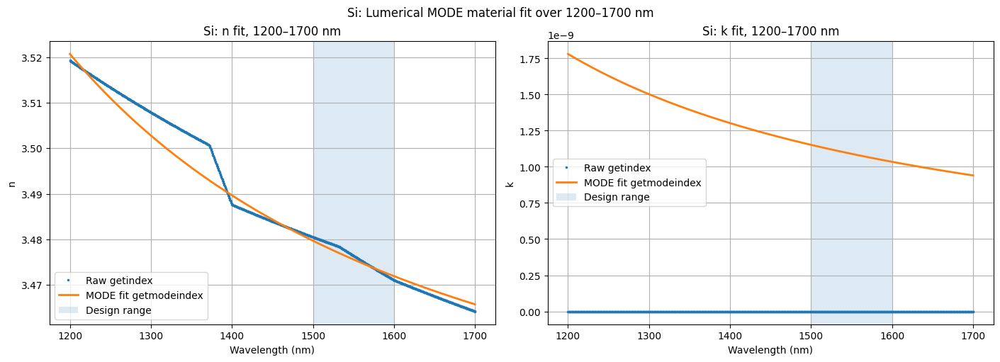 (a) Si fit over 1200–1700 nm.</td>
<td align="center">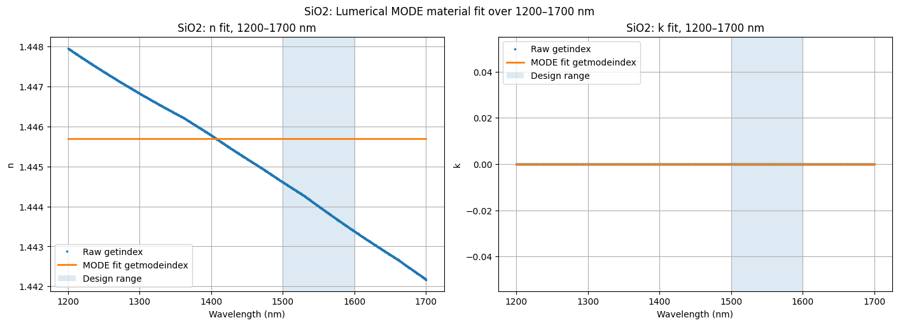 (b) SiO₂ fit over 1200–1700 nm.</td>
</tr>
<tr>
<td align="center">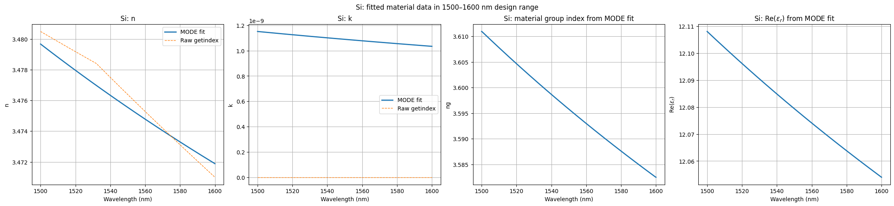 (c) Si properties over 1500–1600 nm.</td>
<td align="center">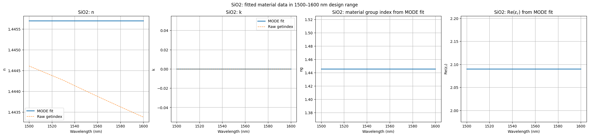 (d) SiO₂ properties over 1500–1600 nm.</td>
</tr>
</table>

**Figure 1: Summary of the Lumerical MODE material fits used in the waveguide simulations. The**

top row shows the Palik raw data together with the fitted material models over the full 1200–1700
nm fitting range, with the shaded region indicating the 1500–1600 nm design band. The bottom
row shows the fitted material properties evaluated directly in the design band, including the real
refractive index n, extinction coefficient k, material group index ng, and real part of the relative
permittivity Re(εr).
SiO2. The shaded region indicates the final 1500–1600 nm design band. The second row shows
the fitted material properties evaluated directly inside the design range. These plots include the
fitted refractive index, extinction coefficient, material group index, and real part of the relative
permittivity.
For silicon, the fitted real index decreases from approximately n ≈ 3.48 near 1500 nm to n ≈ 3.47
near 1600 nm. The fitted extinction coefficient is very small in this band, on the order of 10−9, so
material absorption is negligible for the present passive waveguide simulations. For SiO2, the fitted
refractive index is approximately n ≈ 1.445 and the extinction coefficient is approximately zero in
the design band.
The material group index is calculated from
ng = n − λ
dn
dλ
,
and the relative permittivity is calculated from
εr = ñ2
.
Since the fitted absorption is negligible in the selected wavelength range, the real part of the relative
permittivity is approximately
Re(εr) ≈ n2
.
For silicon, the fitted material group index in the 1500–1600 nm range is approximately ng ≈
3.58–3.61, and Re(εr) decreases from approximately 12.11 to 12.05. For SiO2, the fitted model is
nearly dispersionless in the design band, giving an approximately constant group index and relative
permittivity.
At this stage of the design, the oxide cladding is treated as effectively infinite. This approximation is useful for the initial mode analysis because it isolates the intrinsic waveguide behavior

from finite-cladding and substrate effects. In the final simulation setup, the oxide thickness will be
chosen large enough such that further increases in cladding thickness do not noticeably change the
effective index, mode profile, mode-field diameter, or coupling behavior. Therefore, the infinitecladding approximation is used only as an initial design assumption and will later be verified against
a finite-cladding structure.
The initial material stack is therefore a silicon strip waveguide embedded in SiO2, with a fixed
silicon device-layer thickness of
tSi = 220 nm.
The waveguide width is treated as a design parameter and is swept in the single-waveguide analysis.

### Single-Waveguide Analysis

After defining the material models, the next step is to analyze a single silicon strip waveguide
embedded in SiO2. The silicon thickness is fixed to
tSi = 220 nm,
and the waveguide width is swept in order to study the modal properties of the structure. For
each width, the eigenmodes are calculated using the finite-difference eigenmode solver. The main
extracted quantities are the effective index neff, the group index ng, the horizontal mode-field
diameter MFDx, and the vertical mode-field diameter MFDy.
The width sweep was performed using the notebook single wg mode sweep.ipynb, while the
detailed electric-field and magnetic-field profiles, together with the MFD calculations and field-cut
extraction, were obtained using the notebook single wg mode.ipynb.
The calculated modes are sorted into continuous mode branches according to their effective
index and polarization content. The transverse-electric fraction is used as an indicator of the
polarization character of each mode, where a value close to 1 corresponds to a TE-like mode and
a value close to 0 corresponds to a TM-like mode.

**Figure 2 summarizes the main single-waveguide modal properties as a function of waveguide**

width. The real part of the effective index increases with width because the optical mode becomes
more confined inside the high-index silicon core. At small widths, the effective index is close to the
cladding index and the mode is weakly confined. As the width increases, the mode becomes more
localized in the silicon region and neff approaches larger values.
The group index also depends strongly on the waveguide width. The fundamental TE-like mode
has a relatively large group index due to the combined effect of material dispersion and waveguide
dispersion in the silicon strip waveguide. This parameter is important for later coupler design
because it determines the propagation delay and the wavelength dependence of the optical phase.
The horizontal and vertical mode-field diameters show the confinement behavior more directly.
For the fundamental TE-like mode, MFDx decreases strongly as the waveguide width increases
from the weakly confined regime to the more tightly confined regime. This indicates that wider
waveguides provide stronger lateral confinement. The vertical mode-field diameter MFDy is also
reduced as the mode becomes more confined, although the vertical confinement is mainly controlled
by the fixed 220 nm silicon thickness and the vertical index contrast with the oxide cladding.
To evaluate the degree of lateral confinement more clearly, the ratio MFDx/w is plotted for
the fundamental TE0 mode, where w is the waveguide width. This result is shown in Figure 3.
For narrow waveguides, MFDx/w is much larger than one, meaning that a large part of the mode
extends outside the physical waveguide width. As the width increases, this ratio approaches one,
indicating that the optical mode becomes more confined laterally inside the silicon core.

(a) Effective index neff . (b) Group index ng.
(c) Horizontal mode-field diameter MFDx. (d) Vertical mode-field diameter MFDy.

<!-- figure-2-images -->
<table>
<tr>
<td align="center">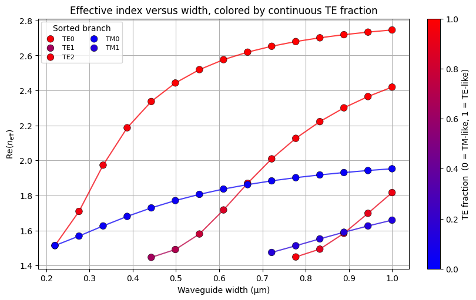 (a) Effective index $n_{eff}$.</td>
<td align="center">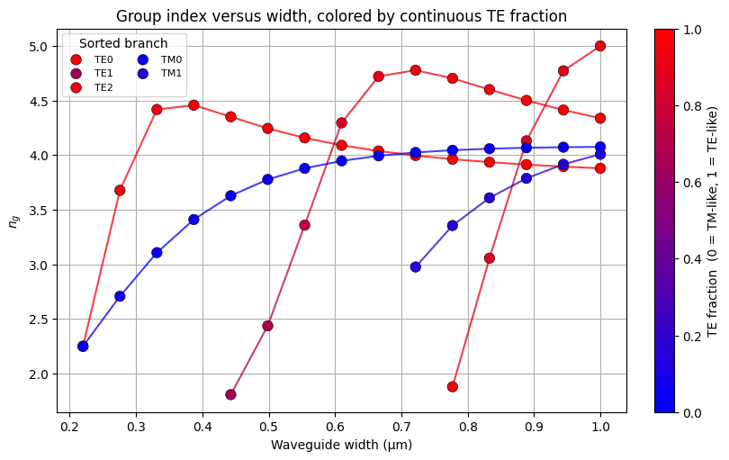 (b) Group index $n_g$.</td>
</tr>
<tr>
<td align="center">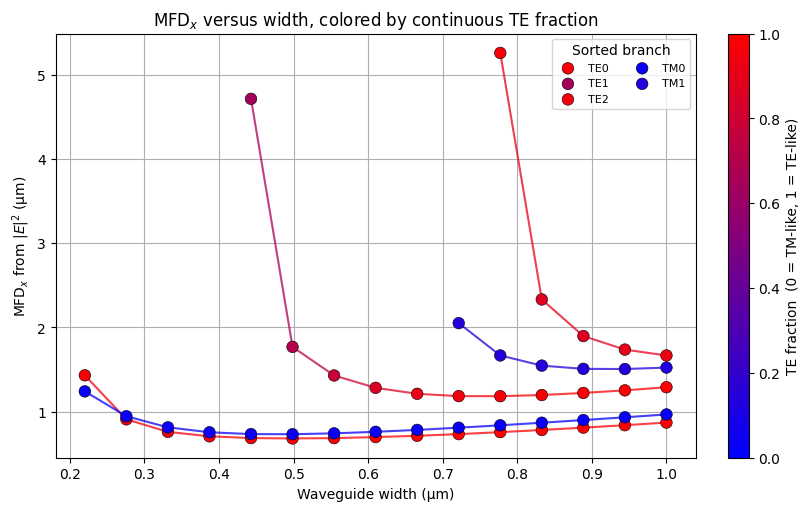 (c) Horizontal mode-field diameter MFDx.</td>
<td align="center">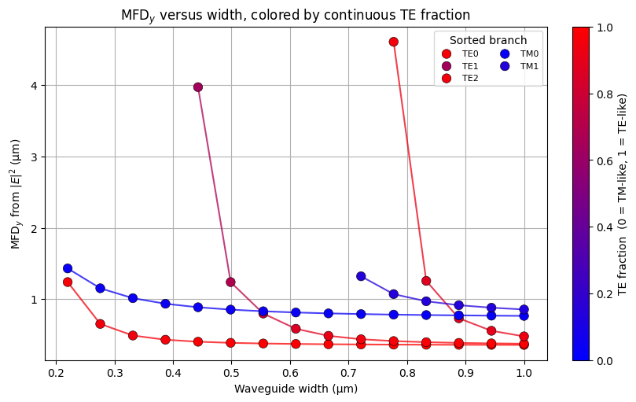 (d) Vertical mode-field diameter MFDy.</td>
</tr>
</table>

**Figure 2: Single-waveguide modal properties as a function of silicon waveguide width for a fixed**

silicon thickness of tSi = 220 nm. The four panels show the effective index, group index, horizontal
mode-field diameter, and vertical mode-field diameter. The mode branches are colored by the
continuous TE fraction, where red corresponds to TE-like modes and blue corresponds to TM-like
modes.
The modal field profiles are also inspected for the two candidate widths,
w = 300 nm and w = 500 nm.
For each width, the real electric- and magnetic-field components of the fundamental mode are
plotted, together with the normalized electric-field intensity |E|2 and its horizontal and vertical
cuts. These field plots are useful because they show the spatial confinement directly, rather than
only through the scalar quantities neff, ng, and MFD.
The four field and cut plots are grouped in Fig. 4. The top row corresponds to the 300 nm-wide
waveguide, and the bottom row corresponds to the 500 nm-wide waveguide. For each width, the
left panel shows the real electric- and magnetic-field components of the fundamental mode, while
the right panel shows the normalized electric-field intensity |E|2 and the corresponding horizontal
and vertical cuts.
For the 300 nm-wide waveguide, the mode is more weakly confined laterally, and the optical
field extends farther into the surrounding SiO2 cladding. This larger evanescent tail is beneficial for
directional coupling because it allows two adjacent waveguides to interact at a larger physical gap.
In contrast, for the 500 nm-wide waveguide, the mode is more strongly confined inside the silicon

<!-- figure-3-images -->

  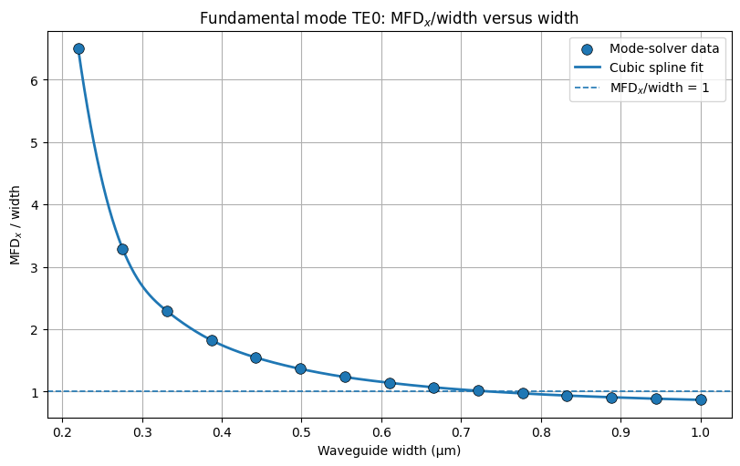

**Figure 3: Ratio MFDx/w versus waveguide width for the fundamental TE0 mode. The dashed**

horizontal line indicates MFDx/w = 1.
core. The extracted mode-field diameter is smaller, and the field decays more rapidly into the
oxide cladding. This stronger confinement is beneficial for compact bends and reduces sensitivity
to small width perturbations, but it also means that smaller waveguide gaps are required in the
double-waveguide coupler to obtain sufficient coupling.
Based on these results, two important design regimes can be identified. A waveguide width near
w = 500 nm
provides stronger confinement of the fundamental TE0 mode. This is beneficial because the mode
is better localized inside the silicon core, which gives better compatibility with compact bends
and reduces the sensitivity of the effective index to small width variations. However, the stronger
confinement also means that the evanescent tail decays more rapidly in the oxide cladding. Therefore, in a directional coupler or double-waveguide geometry, a smaller gap is required to obtain
sufficiently strong coupling.
In contrast, a waveguide width near
w = 300 nm
has a larger horizontal mode-field diameter and a larger evanescent tail. This can be advantageous
for coupling because the same coupling strength can be achieved with a larger physical gap. A larger
gap is generally easier to fabricate and can be less sensitive to small gap variations. However, the
narrower waveguide is more weakly confined, more sensitive to width variations, and generally less
favorable for compact low-loss bends.
The sensitivity of the effective index to waveguide-width variations is shown in Figure 5. Around
w = 300 nm, a width perturbation of ±5 nm produces a larger change in neff than around w =
500 nm. From the spline fit, the extracted values are approximately
neff(300 nm) ≈ 1.8216, ∆neff(±5 nm) ≈ 4.87 × 10−2
,
and
neff(500 nm) ≈ 2.44498, ∆neff(±5 nm) ≈ 1.58 × 10−2
.
Equivalently, the local sensitivities are approximately
dneff
dw w=300 nm
≈ 4.87 × 10−3
nm−1
,

(a) 300 nm waveguide: real E and H field components.
(b) 300 nm waveguide: normalized |E|2
and x/y
cuts.
(c) 500 nm waveguide: real E and H field components.
(d) 500 nm waveguide: normalized |E|2
and x/y
cuts.

<!-- figure-4-images -->
<table>
<tr>
<td align="center">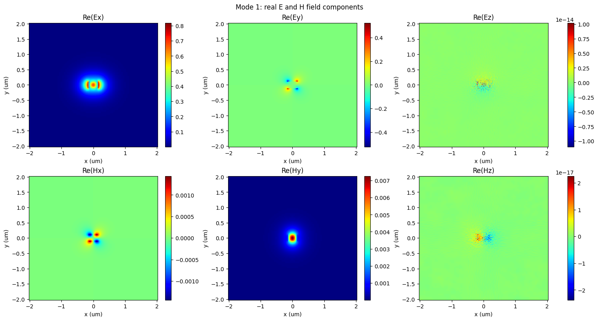 (a) 300 nm waveguide: real E and H field components.</td>
<td align="center">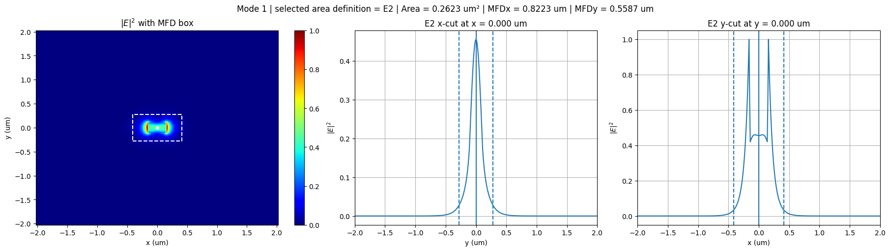 (b) 300 nm waveguide: normalized $|E|^2$ and x/y cuts.</td>
</tr>
<tr>
<td align="center">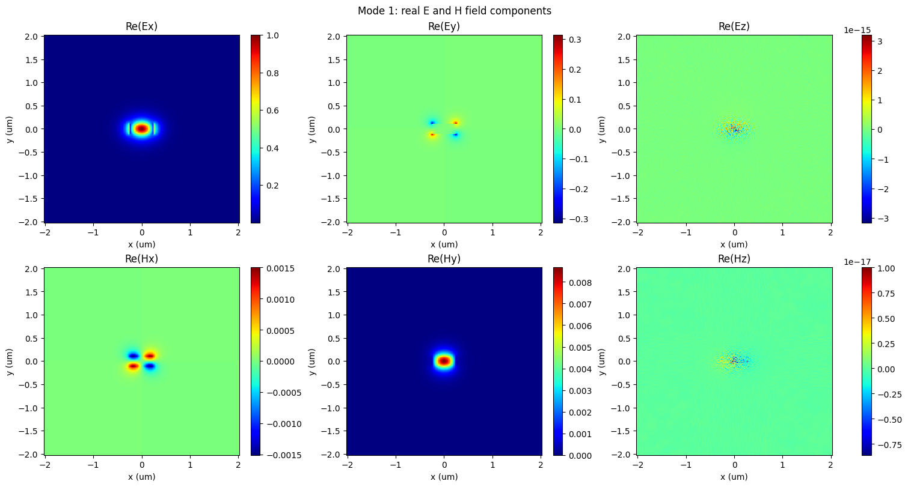 (c) 500 nm waveguide: real E and H field components.</td>
<td align="center">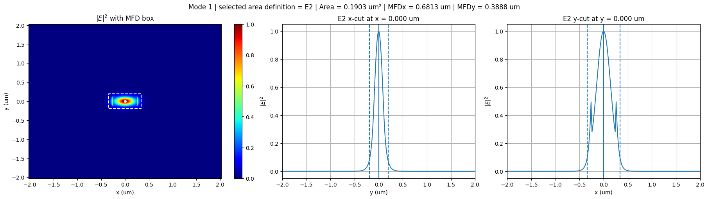 (d) 500 nm waveguide: normalized $|E|^2$ and x/y cuts.</td>
</tr>
</table>

**Figure 4: Fundamental-mode field profiles and intensity cuts for the two candidate waveguide**

widths. The top row shows the 300 nm-wide waveguide and the bottom row shows the 500 nmwide waveguide. The left column shows the real electric- and magnetic-field components, while
the right column shows the normalized electric-field intensity |E|2 together with the horizontal and
vertical cuts used to extract the mode-field diameter.
and
dneff
dw w=500 nm
≈ 1.58 × 10−3
nm−1
.
Therefore, the 500 nm waveguide is expected to be more tolerant to fabrication-induced width
variations.
The main trade-off is therefore between confinement and coupling strength. A 500 nm waveguide provides better confinement, lower sensitivity to width errors, and better compatibility with
compact bends, but it requires smaller coupling gaps because of the shorter evanescent tail. A 300
nm waveguide provides a larger evanescent field and can enable coupling at larger gaps, but it is
less confined and more sensitive to fabrication variations.
For the present design, the 500 nm width is selected as the main candidate for the fundamental
waveguide. Although this width supports additional higher-order modes, the fundamental TE0
mode remains the primary design mode. The higher-order modes have different polarization content
and weaker overlap with the input fundamental mode, so their excitation is expected to be limited
if the input/output transitions and bends are designed adiabatically. This choice will be further
checked in the double-waveguide and full-device simulations.

<!-- figure-5-images -->

  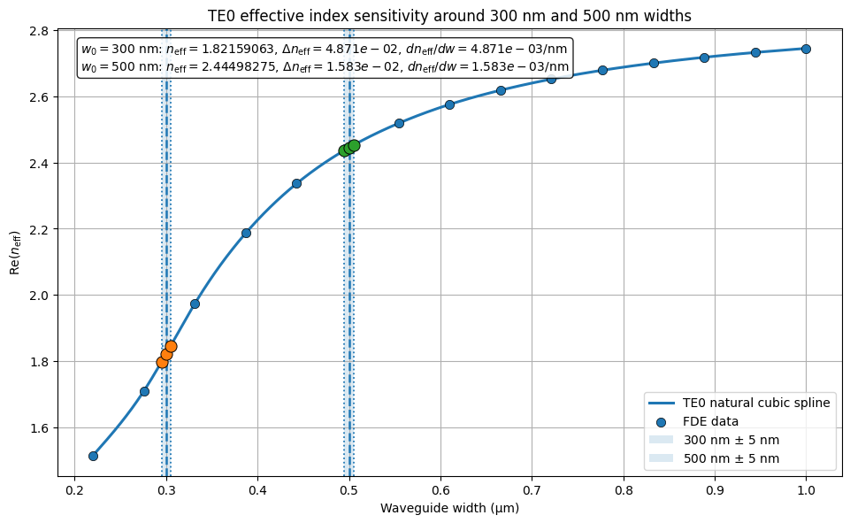

**Figure 5: Sensitivity of the TE0 effective index to waveguide-width variations around 300 nm and**

500 nm. The shaded regions indicate ±5 nm width variations around each nominal width.

### Double-Waveguide Analysis

After selecting candidate single-waveguide widths, the next step is to analyze two identical parallel
silicon waveguides separated by a gap. This structure forms the directional-coupler section of
the beam splitter. In the coupled-waveguide region, optical power is transferred between the two
waveguides through the overlap of their evanescent fields in the SiO2 cladding.
The physics of the directional coupler can be described using coupled-mode theory. If the two
isolated waveguides are identical and phase matched, their uncoupled propagation constants are
equal,
β1 = β2 = β0.
The slowly varying modal amplitudes a1(z) and a2(z) satisfy
da1
dz
= −iκa2,
da2
dz
= −iκa1,
where κ is the coupling coefficient. For excitation in waveguide 1 at z = 0, the solution is
a1(z) = cos(κz), a2(z) = −i sin(κz).
Therefore, the powers in the two waveguides are
P1(z) = cos2
(κz), P2(z) = sin2
(κz).
A 50/50 splitter is obtained when
P1 = P2 =
,
which gives the half-power coupling length
L50/50 =
π
4κ
.
The same coupling coefficient can also be extracted from the even and odd supermodes of the
coupled double-waveguide system. For two identical phase-matched waveguides, the symmetric and
antisymmetric supermodes have propagation constants
βeven = β0 + κ, βodd = β0 − κ.
The propagation-constant splitting is therefore
∆β = βeven − βodd = 2κ.

Using
β = k0neff =
2π
λ0
neff,
the coupling coefficient is
κ =
∆β
=
π
λ0
(neff,even − neff,odd) .
Equivalently, the 50/50 coupling length can be calculated directly from the supermode index splitting:
L50/50 =
π
2∆β
=
λ0
4∆neff
,
where
∆neff = neff,even − neff,odd.
This supermode method is used here to estimate the required coupling length as a function of gap.
The gap sweep was performed using the notebook double wg mode sweep.ipynb, while the
detailed electric-field and magnetic-field profiles, and field-cut extraction, were obtained using the
notebook double wg mode.ipynb.
For waveguide width of 500 nm a fixed gap of g = 150 nm, the even-like and odd-like TE
supermodes are first calculated to verify the coupling behavior. Figure 6 shows the real electricand magnetic-field components of the even-like and odd-like TE supermodes in a two-column tile
format. The even-like mode has the dominant transverse electric field with the same sign in the two
waveguides, while the odd-like mode has the dominant transverse electric field with opposite signs
in the two waveguides. This symmetry difference produces the effective-index splitting between the
two supermodes.
(a) Even-like TE supermode. (b) Odd-like TE supermode.

<!-- figure-6-images -->
<table>
<tr>
<td align="center">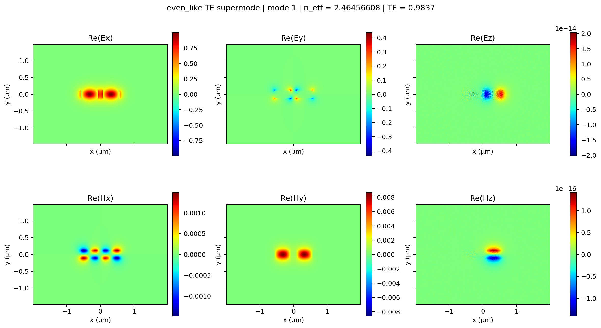 (a) Even-like TE supermode.</td>
<td align="center">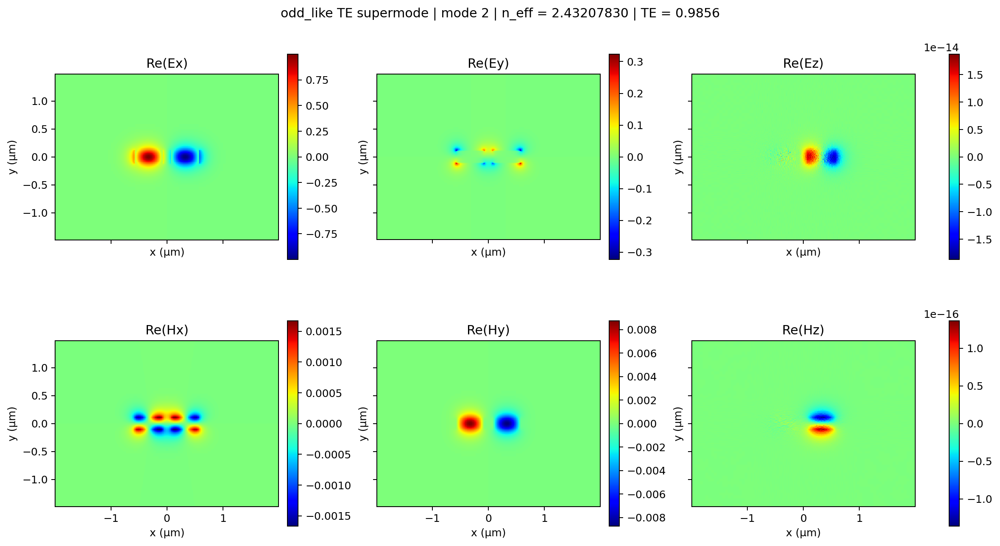 (b) Odd-like TE supermode.</td>
</tr>
</table>

**Figure 6: Real electric- and magnetic-field components of the even-like and odd-like TE supermodes**

for the double silicon waveguide with a fixed gap of g = 150 nm. The two panels are arranged in a
1 × 2 tile format.
The even/odd symmetry is further verified by plotting the dominant field components along the
horizontal cut through the center of the waveguides. Figure 7 shows the verification using Re(Ex)
and Re(Hy) in a two-column tile format. For the even-like supermode, Re(Ex) has the same sign in
the two waveguides. For the odd-like supermode, Re(Ex) changes sign between the two waveguides.
The Re(Hy) cut gives the corresponding magnetic-field symmetry verification.

(a) Even/odd supermode verification using Re(Ex). (b) Even/odd supermode verification using Re(Hy).

<!-- figure-7-images -->
<table>
<tr>
<td align="center">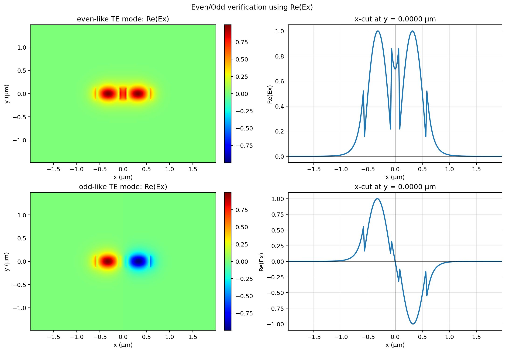 (a) Even/odd verification using Re($E_x$).</td>
<td align="center">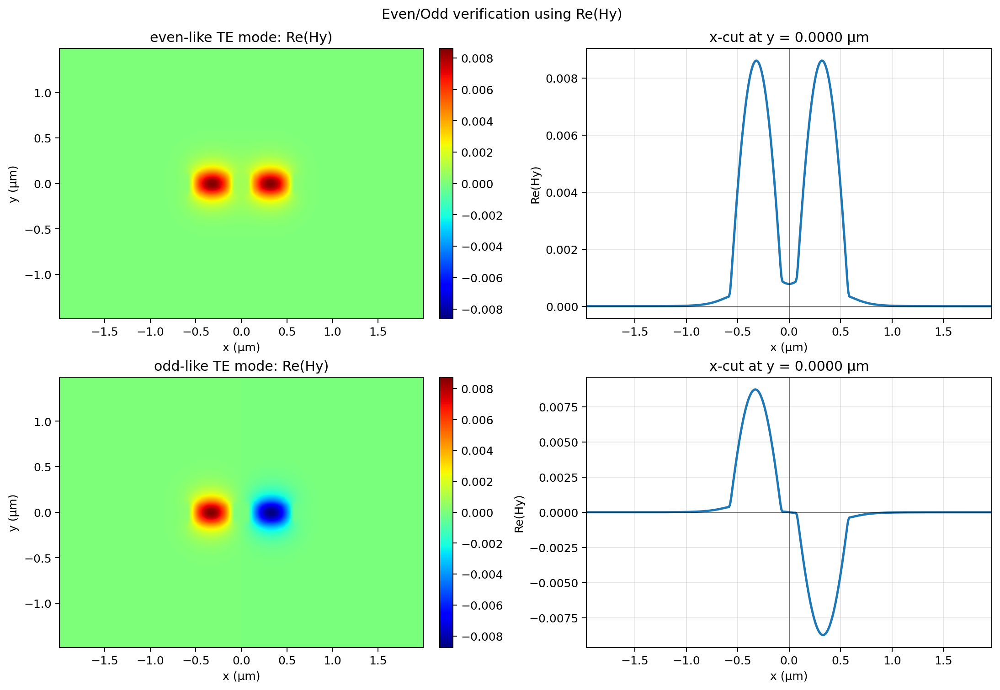 (b) Even/odd verification using Re($H_y$).</td>
</tr>
</table>

**Figure 7: Verification of the even/odd supermode symmetry using horizontal cuts of Re(Ex) and**

Re(Hy). The two panels are arranged in a 1 × 2 tile format.
The gap is then swept for the two candidate waveguide widths,
w = 300 nm and w = 500 nm.
For each width, the even and odd supermode indices are extracted, and the coupling length is
calculated from
L50/50 =
λ0
4∆neff
.
The corresponding coupling coefficient is calculated from
κ =
π
λ0
∆neff.

**Figure 8 summarizes the gap-sweep results for both waveguide widths. The first row shows**

the 50/50 coupling length versus gap, while the second row shows the corresponding supermode
splitting and coupling coefficient. The 300 nm waveguide has a larger evanescent tail, so it can
achieve strong coupling at relatively larger gaps. The 500 nm waveguide is more strongly confined,
so its evanescent field decays faster in the oxide and smaller gaps are required to obtain the same
coupling strength.

(a) L50/50 versus gap for w = 300 nm. (b) L50/50 versus gap for w = 500 nm.
(c) ∆neff and κ versus gap for w = 300 nm. (d) ∆neff and κ versus gap for w = 500 nm.

<!-- figure-8-images -->
<table>
<tr>
<td align="center">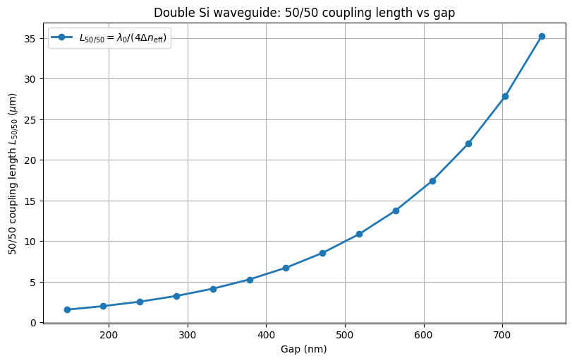 (a) $L_{50/50}$ versus gap for $w=300$ nm.</td>
<td align="center">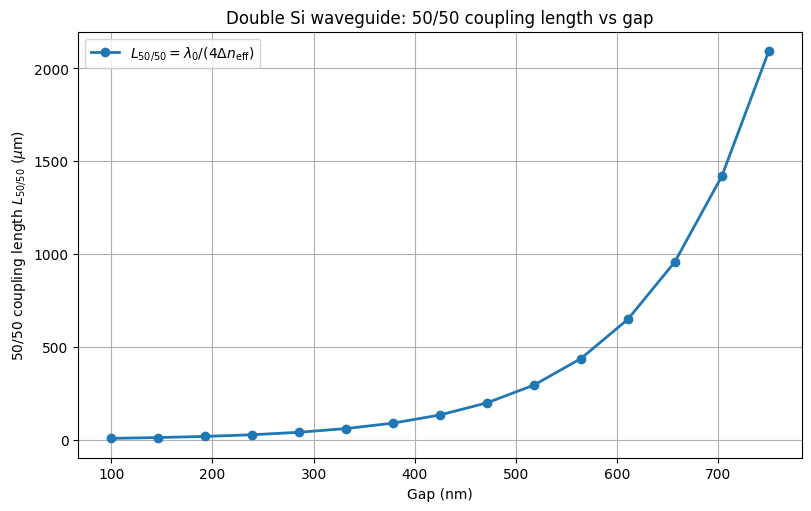 (b) $L_{50/50}$ versus gap for $w=500$ nm.</td>
</tr>
<tr>
<td align="center">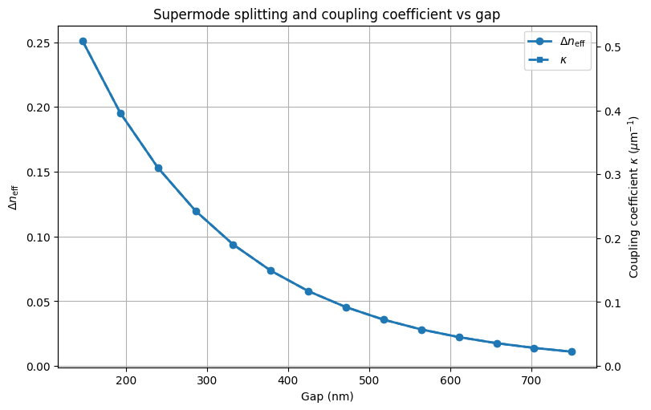 (c) $\Delta n_{eff}$ and $\kappa$ versus gap for $w=300$ nm.</td>
<td align="center">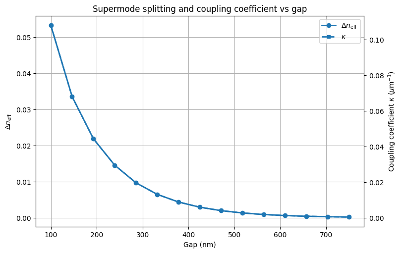 (d) $\Delta n_{eff}$ and $\kappa$ versus gap for $w=500$ nm.</td>
</tr>
</table>

**Figure 8: Gap-sweep results for the double silicon waveguide. The top row shows the 50/50 coupling**

length L50/50 versus gap for the 300 nm and 500 nm waveguide widths. The bottom row shows the
corresponding supermode effective-index splitting ∆neff and coupling coefficient κ.
Fabrication errors can affect the coupler in two main ways. First, width variations change the
isolated-waveguide effective index. If the two waveguides are no longer identical, a propagationconstant mismatch is introduced:
∆βmismatch = β1 − β2.
In the presence of mismatch, the coupled-mode equations become
da1
dz
= −i
∆βmismatch
a1 − iκa2,
da2
dz
= +i
∆βmismatch
a2 − iκa1.
The maximum transferable power is then reduced to approximately
P2,max =
κ2
κ2 + (∆βmismatch/2)2 .
Therefore, robust coupling requires
κ ≫
|∆βmismatch|
.
This means that stronger coupling is more tolerant to width-induced phase mismatch.

Second, gap variations directly change the coupling coefficient κ. Since κ depends strongly on
the evanescent overlap, large gaps produce weak coupling and can make the coupling length very
sensitive to small gap errors. Smaller gaps give stronger coupling, shorter coupling lengths, and
better tolerance to phase mismatch. However, very small gaps can be more challenging to fabricate
and may increase sensitivity to absolute gap errors. Therefore, the selected gap should be small
enough to provide strong coupling, but not so small that fabrication becomes unreliable.
To quantify this robustness, the coupling coefficient is compared with the estimated phasemismatch scale caused by width variations. The width-mismatch detuning is estimated as
∆βmismatch =
2π
λ0
∆neff,mismatch.
The safe region is defined as the gap range where
κ >
|∆βmismatch|
.
In this regime, the coupling strength dominates over the width-induced phase mismatch, so the
directional coupler is expected to be more robust against fabrication tolerance.

**Figure 9 shows the safe-zone analysis for both waveguide widths. The shaded regions indicate**

the gap ranges where the coupling coefficient is larger than the estimated width-mismatch detuning.
The 300 nm waveguide can remain robust over a larger gap range because of its stronger evanescent
overlap. The 500 nm waveguide requires a smaller gap to reach the same robustness condition, but
it benefits from better single-waveguide confinement and lower sensitivity of the isolated mode to
width variations.
(a) Safe-zone analysis for w = 300 nm. (b) Safe-zone analysis for w = 500 nm.

<!-- figure-9-images -->
<table>
<tr>
<td align="center">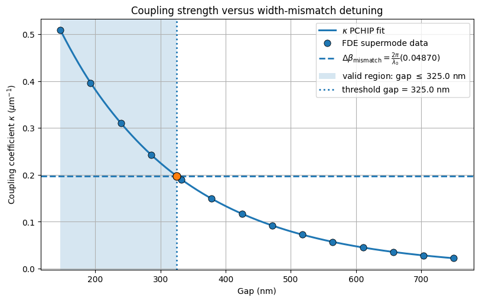 (a) Safe-zone analysis for $w=300$ nm.</td>
<td align="center">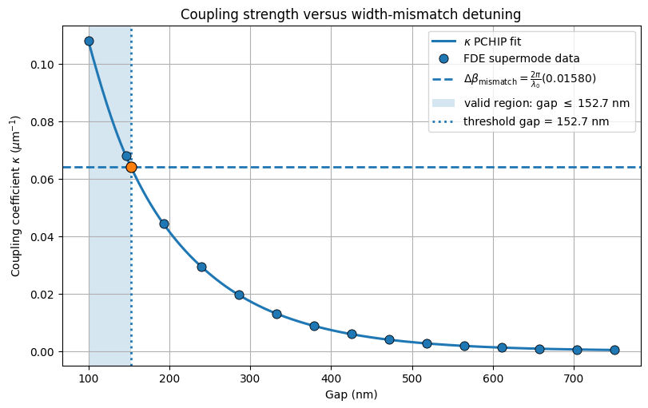 (b) Safe-zone analysis for $w=500$ nm.</td>
</tr>
</table>

**Figure 9: Robustness analysis against width-mismatch detuning for the 300 nm and 500 nm waveguide widths. The shaded region indicates the gap range where the coupling coefficient κ is larger**

than the estimated phase-mismatch scale, giving a more robust directional coupler.
The numerical design candidates extracted from the gap sweep are summarized directly in
Tables 2a and 2b. The tables are placed inside the text using the [H] placement option to prevent
them from floating to the end of the document. For the 300 nm waveguide, larger gaps can
still provide short coupling lengths because the mode is less confined and has stronger evanescent
overlap. For the 500 nm waveguide, smaller gaps are required to obtain compact couplers.

(a) Candidate 50/50 coupling lengths for the w =
300 nm silicon waveguide.
Waveguide width Gap L50/50
300 nm 150 nm 1.574 µm
300 nm 200 nm 2.059 µm
300 nm 250 nm 2.677 µm
(b) Candidate 50/50 coupling lengths for the w =
500 nm silicon waveguide.
Waveguide width Gap L50/50
500 nm 125 nm 8.911 µm
500 nm 150 nm 11.960 µm
500 nm 200 nm 18.895 µm

**Table 2: Candidate 50/50 coupling lengths for the two selected waveguide widths. The highlighted**

entries indicate the preferred design points for each width.
Overall, the double-waveguide analysis confirms the main trade-off observed in the singlewaveguide study. Narrower waveguides provide larger evanescent tails and allow coupling at larger
gaps, while wider waveguides provide stronger confinement and better compatibility with compact
routing and bends, but require smaller gaps to obtain strong coupling. From the robustness analysis, the selected gap should lie inside the safe zone where the coupling coefficient is larger than the
width-mismatch detuning. Therefore, for the 300 nm waveguide, gaps around 150–250 nm are compact and robust candidates, while for the 500 nm waveguide, gaps around 125–200 nm should be
evaluated further using full directional-coupler simulations. Based on the highlighted design points
in Table 2, the selected coupling gaps for the next-stage beam-splitter simulations are g = 250 nm
for the 300 nm waveguide and g = 150 nm for the 500 nm waveguide.

## 2. Beam-Splitter Layout Generation and Simulation Workflow

### Layout Generation

After selecting the waveguide widths, gap candidates, and initial coupling lengths from the coupledmode analysis, the next step is to build the full beam-splitter geometry and prepare it for numerical
tuning. The beam splitter is designed as a symmetric directional coupler, where the two input and
two output waveguides are connected to the central coupling region through identical S-bends.
This symmetric layout keeps the two optical paths geometrically equivalent and helps preserve a
balanced splitting response between the two output ports.
The outer waveguide pitch is chosen such that the interaction between the uncoupled input and
output arms is negligible before and after the directional-coupler region. In this design, the pitch
is set to the lowest practical value of
P = 4 µm,
which keeps the layout compact while still making the residual coupling between the separated
arms negligible. Reducing the pitch also reduces the lateral displacement required in the S-bends,
and therefore reduces the longitudinal routing length. However, the local bend radius must remain
sufficiently large to avoid radiation loss. As a first design estimate, the S-bends are chosen such
that the minimum bend radius satisfies
Rmin > 50 µm.
The required S-bend length can be estimated from this bend-radius constraint. For a compact
first design, each S-bend is described by a smooth raised-cosine trajectory,
y(x) =
∆y

1 − cos

πx
LSB

, 0 ≤ x ≤ LSB,

where LSB is the longitudinal S-bend length and ∆y is the lateral displacement of one waveguide
arm. The local radius of curvature is
R(x) =
h
1 + (y′(x))2
i3/2
|y′′(x)|
.
For moderate slopes, the slope correction in the numerator can be neglected for a first estimate.
Since
y′′
(x) =
∆y

π
LSB
2
cos

πx
LSB

,
the maximum curvature occurs near the ends of the S-bend, giving
Rmin ≈
2L2
SB
π2∆y
.
Therefore, for a target minimum bend radius Rmin, the required S-bend length is estimated as
LSB ≳
r
π2Rmin∆y
.
In the symmetric beam-splitter layout, the outer port pitch is P, while the center-to-center
separation in the coupling region is
s = w + g,
where w is the waveguide width and g is the physical gap between the two waveguides. Therefore,
each waveguide arm must move laterally by
∆y =
P − s
=
P − (w + g)
.
Using the chosen pitch P = 4 µm and requiring Rmin ≥ 50 µm, the S-bend length can be estimated
for each design.
For example, for the design
w = 0.300 µm, g = 0.250 µm,
the center-to-center separation in the coupling region is
s = w + g = 0.550 µm.
Thus, the lateral displacement of each arm is
∆y =
4.000 − 0.550
= 1.725 µm.
The required S-bend length is then approximately
LSB ≳
r
π2(50)(1.725)
= 20.6 µm.
Therefore, an S-bend length of about
LSB ≈ 21 µm

is the minimum first estimate for this geometry. In practice, a slightly longer value, such as
LSB = 25 µm,
can be used to provide margin against radiation loss and discretization effects in the layout and
simulation.
The complete beam-splitter layout consists of three main regions: an input S-bend section, a
straight coupling section, and an output S-bend section. The straight coupling section has length
Lc, while the physical gap between the two waveguides is g. For each selected gap, the initial value
of Lc is taken from the coupled-mode-theory estimate obtained from the even–odd supermode
splitting.
However, the CMT value of Lc is only an initial guess for the complete routed beam splitter.
In the ideal straight directional-coupler calculation, the two waveguides are assumed to be parallel
and separated by a fixed gap over the full interaction length. In the actual layout, the waveguides
approach the coupling region gradually through the S-bends. Therefore, the separation is not
initialized abruptly, and part of the optical power transfer can already begin during the transition
into the coupling region. As a result, the optimal coupling length of the full routed beam splitter
is expected to be slightly shorter than the coupling length predicted by the ideal straight-coupler
CMT model.
The layout generation is performed using the notebook
BeamSplitter layout.ipynb.
This notebook generates the symmetric beam-splitter geometry for user-defined values of the waveguide width w, gap g, coupling length Lc, and S-bend longitudinal length LSB. In addition to the
full beam splitter, the notebook also generates a single-arm reference structure. This reference arm
is useful for separating the excess loss of the full beam splitter from the propagation and bend
losses associated with a single routed waveguide arm.
The generated GDS layout uses separate layers for the optical waveguide geometry, text labels,
and optional port or alignment markers. In this implementation, the silicon waveguide pattern is
written on the main device layer
Si waveguide : (1, 0),
where the first number is the GDS layer number and the second number is the datatype. The text
labels used for identifying the device parameters and port names are written on
Text labels : (10, 0),
and optional port-marker or simulation-marker polygons can be placed on
Markers : (100, 0).
These layers are used only to organize the mask layout and the simulation import. In the Lumerical
simulation step, the silicon device layer (1, 0) is imported as the 220 nm-thick Si core, while the
oxide cladding and substrate are defined directly inside the simulation environment.
As an example layout, the beam splitter is generated for
w = 0.300 µm, g = 0.250 µm, Lc = 2.67 µm,
with the S-bend longitudinal length chosen from the bend-radius constraint. The corresponding
layout is shown in Fig. 10. The four optical ports are labeled as the upper and lower input ports

on the left side, and the upper and lower output ports on the right side. This geometry is used as
an initial routed design for numerical simulation and coupling-length tuning.

<!-- figure-10-images -->

  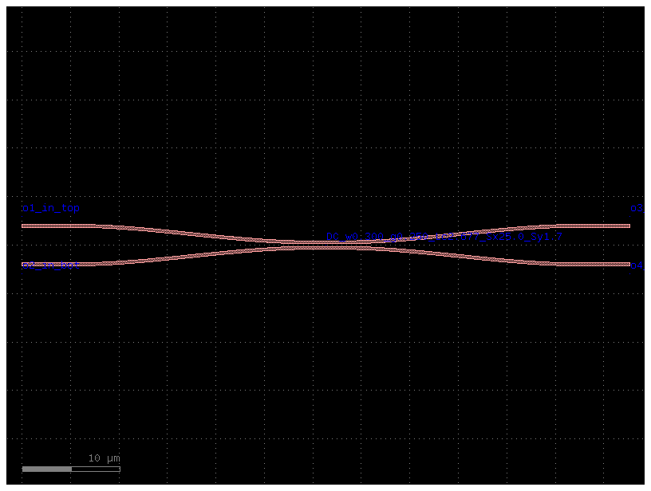

**Figure 10: Example generated GDS layout of the symmetric directional-coupler beam splitter for**

w = 0.300 µm, g = 0.250 µm, and Lc = 2.67 µm. The input and output waveguides are connected
to the central coupling region using identical S-bends, with an outer port pitch of P = 4 µm. The
silicon waveguide pattern is placed on GDS layer (1, 0), while text labels are placed on layer (10, 0).

### Simulation and Validation

After the GDS layout is generated, the beam splitter is imported into Lumerical for electromagnetic
simulation. Two numerical approaches are considered: finite-difference time-domain simulation and
eigenmode expansion simulation. The FDTD method provides a direct full-wave verification of the
device response, including radiation loss, reflections, finite-cladding effects, and possible parasitic
scattering. However, it can be computationally expensive for long directional-coupler structures
with multiple ports. Therefore, for the initial tuning of the coupling length, the eigenmode expansion method is used as the more efficient approach.
The FDTD simulation workflow is automated using the notebooks
FDTD tuned beam splitter infinite cladding.ipynb
and
FDTD tuned beam splitter finite cladding.ipynb.

These notebooks import the generated GDS file into Lumerical, define the silicon and silicon-dioxide
material models, set the waveguide geometry, add sources and monitors, and automate the fourport beam-splitter simulation. The infinite-cladding version is used for the first design tuning step,
while the finite-cladding version can later be used to check the effect of a more realistic oxide stack.
For faster tuning, the EME simulation workflow is implemented using the notebooks
EME tuned beam splitter infinite cladding.ipynb
and
EME tuned beam splitter finite cladding.ipynb.
The EME method is especially suitable for this structure because the device is mainly composed of
slowly varying waveguide sections and a straight directional-coupler region. This makes it possible
to sweep the coupling length Lc and wavelength much more efficiently than with FDTD.
In the EME model, the imported GDS geometry is first extruded into a three-dimensional
silicon waveguide structure with the correct device-layer thickness. The silicon core and silicondioxide cladding material models are then assigned, and the EME simulation region is placed
around the complete routed beam splitter. The transverse simulation span is chosen large enough
to include all four waveguide ports and the surrounding cladding. The mesh is refined around the
silicon waveguides and the coupling region so that the narrow gap and the waveguide sidewalls are
resolved accurately.
The four EME ports are placed at the straight input and output waveguide sections, after the
S-bend routing. Each port solves the local guided mode at that cross section, and the EME solver
propagates the modal amplitudes through the device. The central directional-coupler region is then
swept in length to tune the power exchange between the two output waveguides. A representative
EME setup, showing the imported geometry, mesh, and port locations, is shown in Fig. 11.

<!-- figure-11-images -->

  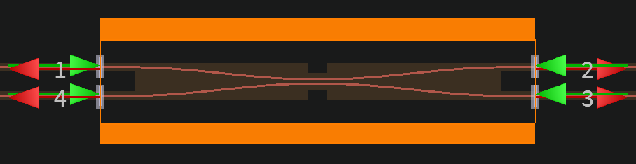

**Figure 11: EME simulation setup for the four-port beam splitter. The imported GDS geometry is**

meshed, and the four EME ports are placed on the straight waveguide sections at the input and
output sides of the routed directional coupler.
The S-matrix index ordering used by Lumerical must be mapped carefully to the physical port
labels. In this simulation, the source-mode index mapping is
S-matrix index Physical source mode
1 port 1, mode 1
2 port 4, mode 1
3 port 2, mode 1
4 port 3, mode 1

as shown in Fig. 12. Therefore, when the input is launched from physical port 1, the transmission
to physical port 2 is extracted from
|s31|2
,
and the transmission to physical port 3 is extracted from
|s41|2
.
These two quantities are the through and cross output powers used for the beam-splitter tuning.

<!-- figure-12-images -->

  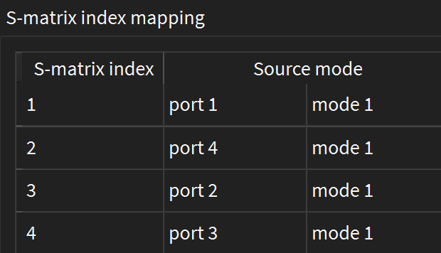

**Figure 12: S-matrix index mapping used in the EME simulation. The physical port order is not**

the same as the numerical S-matrix order, so the transmission terms must be selected using this
mapping.
In this project, the initial tuning is performed using the infinite-cladding EME model. The
objective of the tuning is to find the coupling length Lc that gives a balanced 50/50 output splitting
ratio. The tuning starts from the coupled-mode-theory estimate of Lc for both selected waveguide
widths,
w = 300 nm and w = 500 nm.
For the w = 300 nm design, the selected gap is
g = 250 nm,
and for the w = 500 nm design, the selected gap is
g = 150 nm.
For each design case, the coupling length is swept around the initial coupled-mode-theory estimate,
and the wavelength response is evaluated over
1500 nm ≤ λ ≤ 1600 nm.
The normalized through and cross splitting ratios are defined as
ηthrough =
Pthrough
Pthrough + Pcross
, ηcross =
Pcross
Pthrough + Pcross
,

where Pthrough and Pcross are the transmitted powers at the two output ports. For excitation from
physical port 1, these are extracted from the EME S-matrix as
Pthrough = |s31|2
, Pcross = |s41|2
,
using the S-matrix mapping described above. The ideal 50/50 beam-splitting condition is therefore
ηthrough = ηcross = 0.5.
Equivalently, the tuning can be performed by minimizing the splitting imbalance
∆BS = |ηcross − ηthrough| .

**Figure 13 shows the EME coupling-length sweeps for the two selected designs. For the w =**

300 nm, g = 250 nm design, balanced 50/50 operation occurs at approximately
Lc = 1.77 µm, 7.195 µm, 12.617 µm.
The spacing between consecutive 50/50 points gives an effective coupling period of approximately
Lπ ≈ 5.42 µm.
For the w = 500 nm, g = 150 nm design, the 50/50 points occur at approximately
Lc = 7.49 µm, 32.26 µm, 57.04 µm.
The corresponding effective coupling period is
Lπ ≈ 24.77 µm.
The much longer coupling period for the 500 nm waveguide is expected because the wider waveguide
confines the optical mode more strongly, reducing the evanescent overlap between the two coupled
waveguides.
(a) w = 300 nm, g = 250 nm. (b) w = 500 nm, g = 150 nm.

<!-- figure-13-images -->
<table>
<tr>
<td align="center">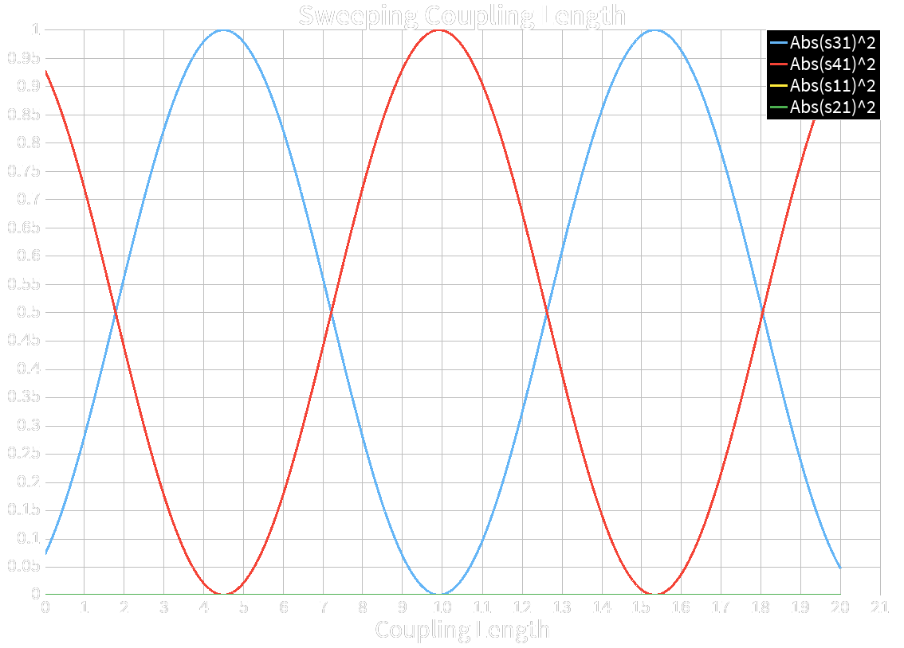 (a) $w=300$ nm, $g=250$ nm.</td>
<td align="center">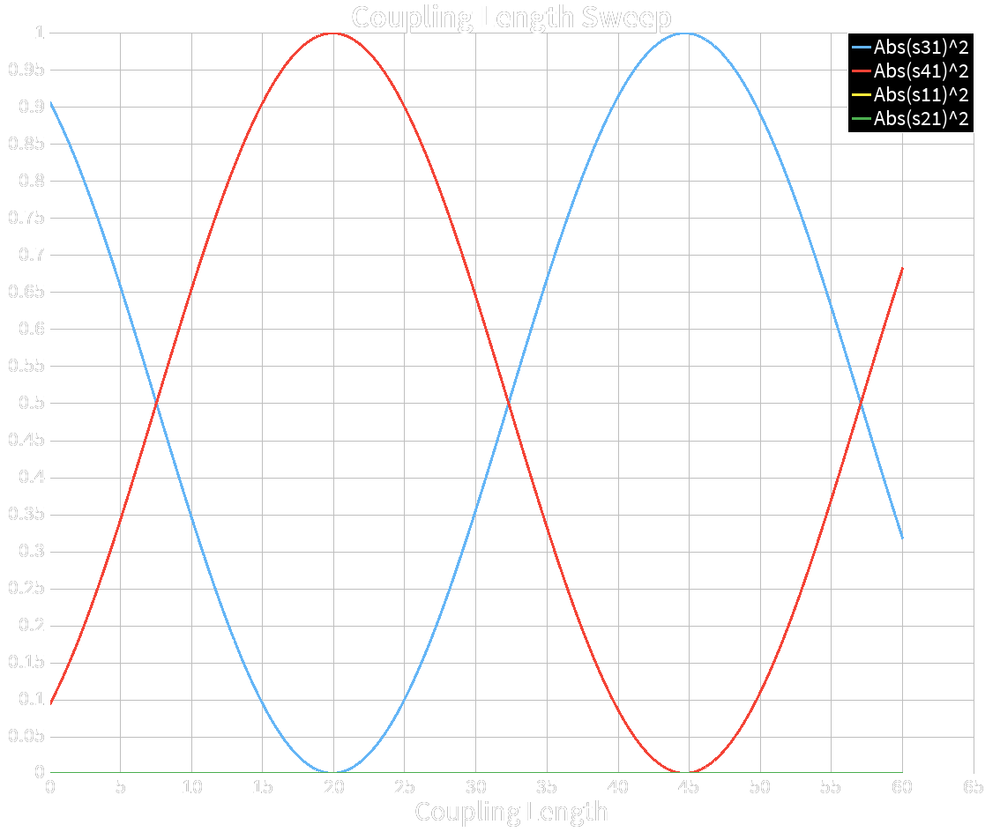 (b) $w=500$ nm, $g=150$ nm.</td>
</tr>
</table>

**Figure 13: EME coupling-length sweeps for the selected beam-splitter geometries. The plotted**

quantities are the output powers extracted from the S-matrix, with |s31|2 and |s41|2 corresponding
to the two output ports for excitation from physical port 1. The 50/50 operating points occur
where the two output powers cross at 0.5.

After selecting a 50/50 coupling length, the wavelength response is simulated to evaluate the
bandwidth of the beam splitter. Figure 14 shows the wavelength sweep for the selected couplinglength cases. The plotted curves show how the through and cross output powers vary across the
1500–1600 nm band. The crossing point near
λ = 1550 nm
corresponds to the designed 50/50 operating wavelength. Away from this wavelength, the splitting ratio changes because the even–odd supermode index splitting, and therefore the coupling
coefficient, is wavelength dependent.
(a) Wavelength sweep for the w = 300 nm design. (b) Wavelength sweep for the w = 500 nm design.

<!-- figure-14-images -->
<table>
<tr>
<td align="center">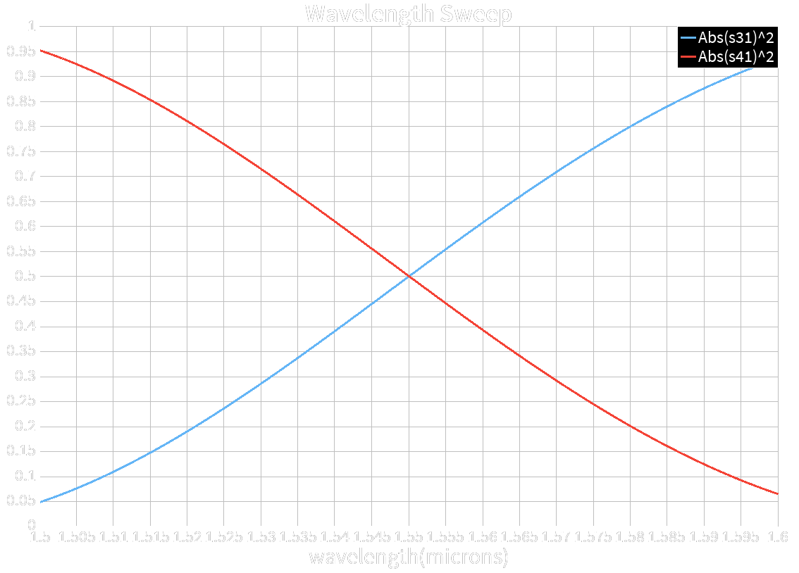 (a) Wavelength sweep for the $w=300$ nm design.</td>
<td align="center">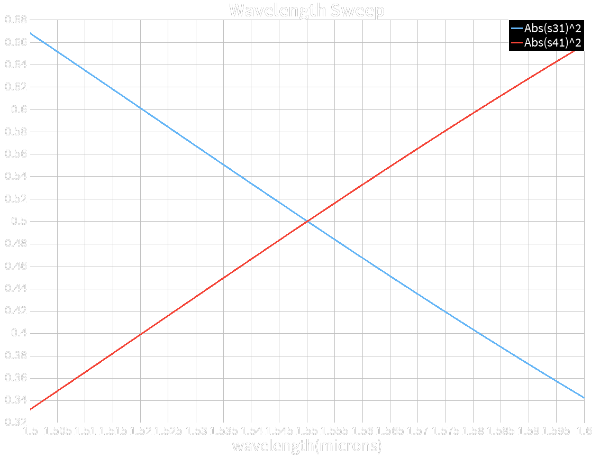 (b) Wavelength sweep for the $w=500$ nm design.</td>
</tr>
</table>

**Figure 14: Wavelength response of the tuned beam splitters. The crossing of |s31|2 and |s41|2**

indicates the 50/50 splitting point. The wavelength dependence of the splitting ratio comes from
the dispersion of the coupled supermodes.
As a preliminary full-wave check, a quick low-accuracy FDTD simulation was also performed
for one of the designed 50/50 beam-splitter geometries. This simulation was not intended as the
final quantitative validation, but rather as a sanity check to verify that the full three-dimensional
structure shows the expected power-transfer behavior. The FDTD setup includes the imported
silicon waveguide geometry, the surrounding oxide cladding region, mode sources/ports at the input
and output waveguides, and frequency-domain monitors for extracting the wavelength-dependent
S-matrix response. The simulation region, port placement, and extracted S-matrix response are
shown in Fig. 15.

(a) Three-dimensional FDTD setup.
(b) Low-accuracy FDTD S-matrix wavelength
sweep.

<!-- figure-15-images -->
<table>
<tr>
<td align="center">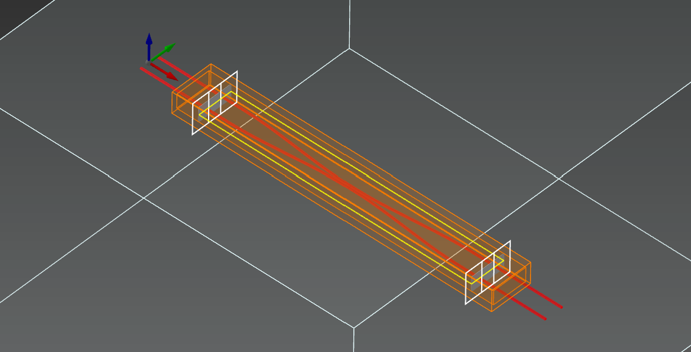 (a) Three-dimensional FDTD setup.</td>
<td align="center">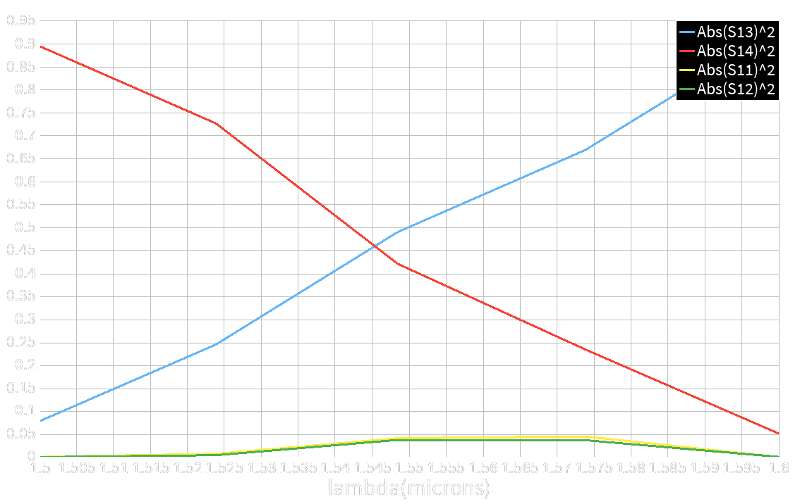 (b) Low-accuracy FDTD S-matrix wavelength sweep.</td>
</tr>
</table>

**Figure 15: Preliminary low-accuracy FDTD validation of the designed 50/50 beam splitter. (a)**

The imported GDS geometry is extruded into the silicon device layer, and the FDTD region is
placed around the complete routed directional-coupler structure. (b) The two dominant output
terms, |S13|2 and |S14|2, become approximately balanced near the design wavelength, showing that
the full-wave response is roughly consistent with the expected beam-splitting behavior.
For excitation from the selected input port, the two dominant output terms are approximately
balanced near the design wavelength. In this FDTD port convention, the main output channels
are represented by |S13|2 and |S14|2, while the reflection and leakage terms remain much smaller.
Around the 50/50 point, the two output powers are close to each other, confirming that the device
behavior is roughly consistent with the EME tuning result. The residual imbalance and small
parasitic terms are expected to be affected by the coarse simulation accuracy, mesh resolution,
finite simulation time, and the preliminary port/monitor setup. Therefore, this result is used only
as an initial validation of the qualitative behavior, while the final performance should be checked
later using a higher-accuracy FDTD run.
These EME and preliminary FDTD results show that the complete routed beam splitter can
be tuned to 50/50 operation by adjusting the central coupling length. The optimized value is not
necessarily identical to the simple coupled-mode-theory estimate because the full layout includes Sbend transitions, finite port sections, and the actual modal evolution through the routed structure.
Therefore, the final coupling length should be selected from the layout-level EME sweep rather
than from the isolated straight-coupler calculation alone.
After the EME sweep identifies the best value of Lc, the final tuned design can be verified
using a higher-accuracy FDTD simulation. This final verification should use a finer mesh, longer
simulation time, and carefully converged port/monitor settings to check the full-wave response of
the selected geometry, estimate radiation loss and reflection, and compare the infinite-cladding and
finite-cladding models. In this way, the complete design workflow uses coupled-mode theory for the
initial physical estimate, EME for efficient layout-level tuning, a quick FDTD run for qualitative
behavioral confirmation, and a final converged FDTD simulation for electromagnetic validation.

### Test Structures

For each selected beam-splitter design point, defined by the waveguide width w, the coupling gap
g, and the coupling length Lc, a set of test structures is generated and placed on the final chip.
The purpose of these structures is to make the beam splitter measurable in several configurations,

rather than relying only on a single four-port measurement. Each test structure uses the same beamsplitter geometry, so that the measured response can be compared across direct transmission, cross
coupling, cascaded operation, phase-sensitive interference, and reference routing structures.
The test structures are designed with grating-coupler access ports and routed waveguides, so
that the devices can be measured using a fiber array. The labels on each structure include the
beam-splitter parameters,
w, g, Lc,
which makes each cell directly identifiable under the microscope and in the final GDS layout.
(a) Master cell containing all
seven test structures.
(b) TS01: four-port beam-splitter
characterization.
(c) TS02: single-input beamsplitter routing reference.
(d) TS03: equivalent-path reference structure.
(e) TS04: cascaded beam-splitter
structure.
(f) TS05: three-grating-coupler
loop/interference structure.
(g) TS06: beam-splitter combiner
structure.
(h) TS07: phase-sensitive MZIstyle beam-splitter structure.

<!-- figure-16-images -->
<table>
<tr>
<td align="center">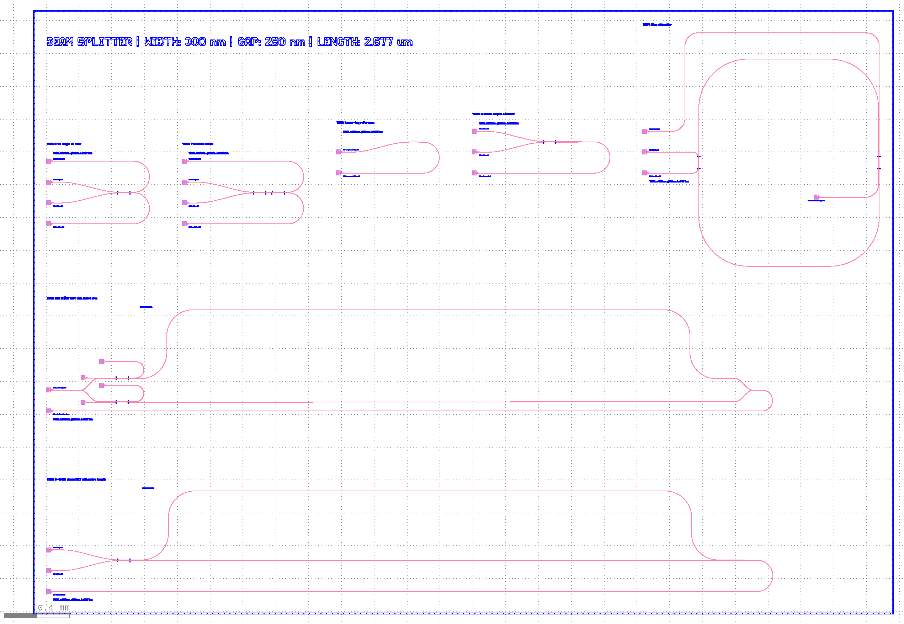 (a) Master cell containing all seven test structures.</td>
<td align="center">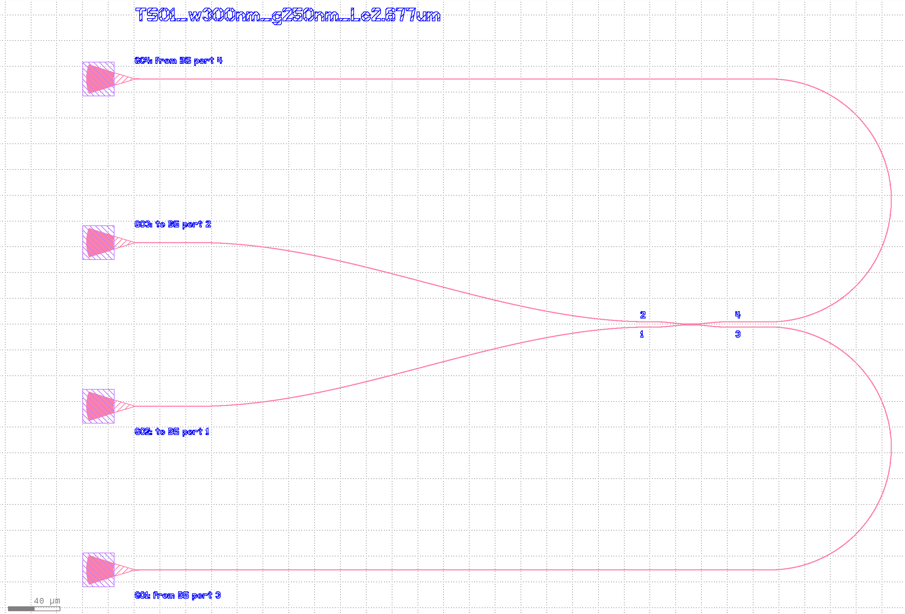 (b) TS01: four-port beam-splitter characterization.</td>
</tr>
<tr>
<td align="center">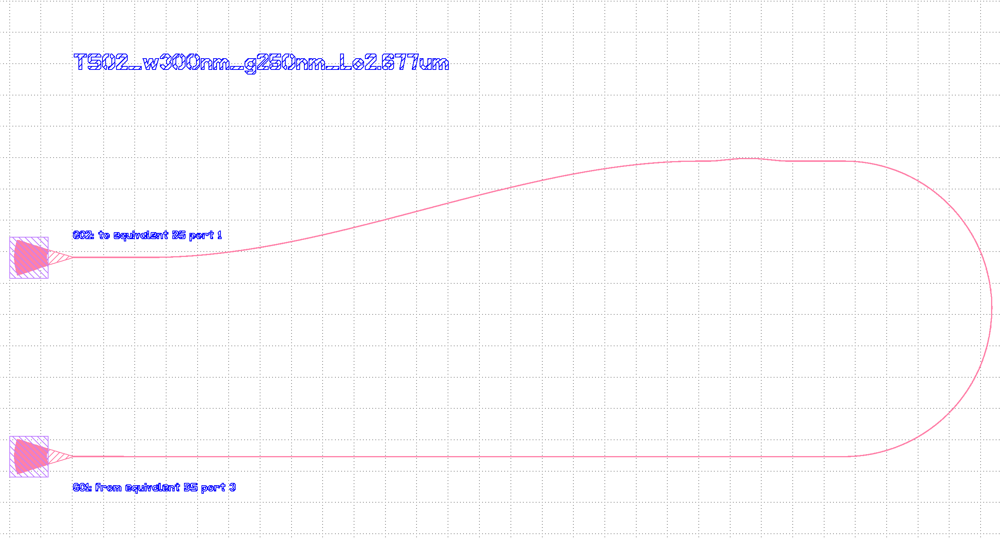 (c) TS02: single-input beam-splitter routing reference.</td>
<td align="center">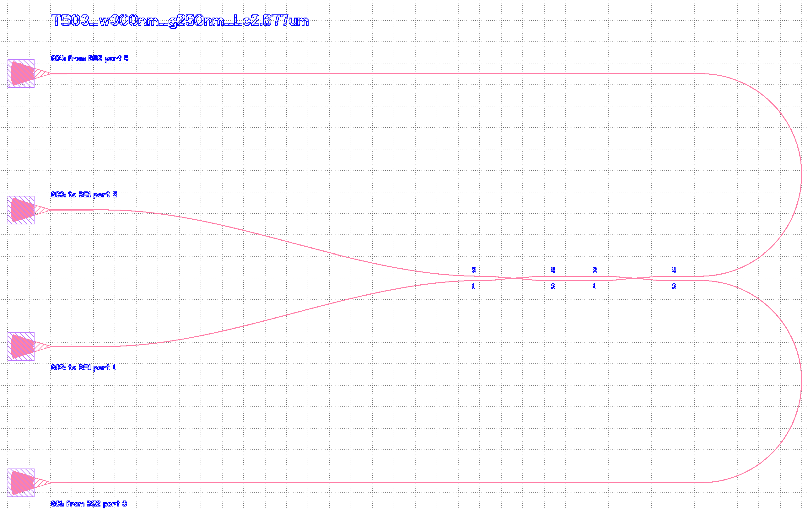 (d) TS03: equivalent-path reference structure.</td>
</tr>
<tr>
<td align="center">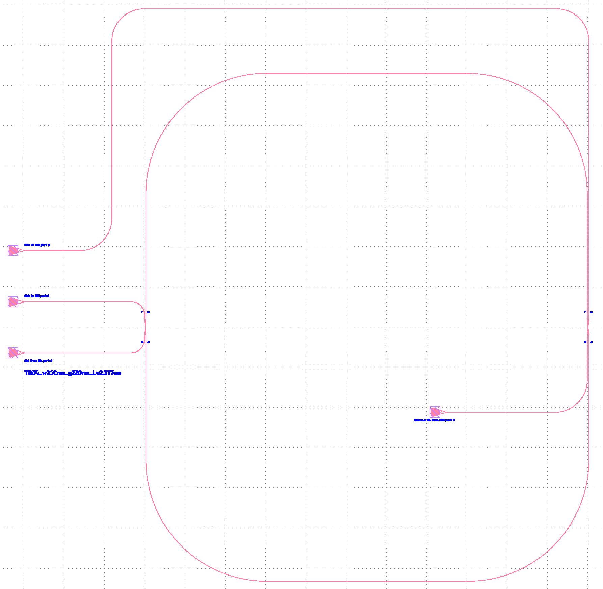 (e) TS04: cascaded beam-splitter structure.</td>
<td align="center">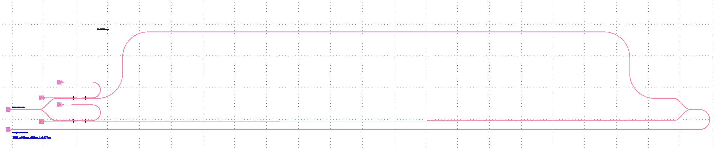 (f) TS05: three-grating-coupler loop/interference structure.</td>
</tr>
<tr>
<td align="center">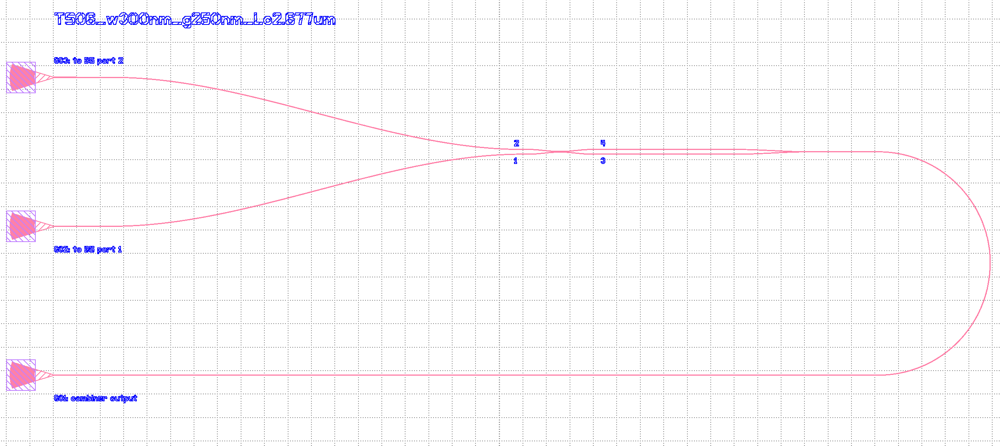 (g) TS06: beam-splitter combiner structure.</td>
<td align="center">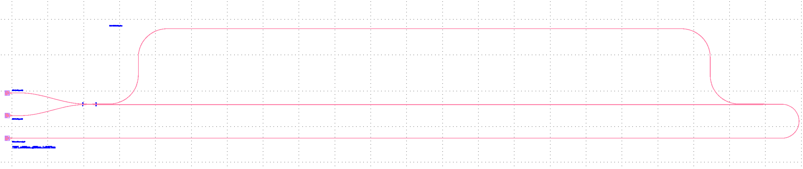 (h) TS07: phase-sensitive MZI-style beam-splitter structure.</td>
</tr>
</table>

**Figure 16: Generated test-structure layouts for one beam-splitter design point. The first panel**

shows the master cell containing all test structures, while the remaining panels show TS01–TS07
individually.
**1. TS01: Four-port beam-splitter characterization.**

TS01 is the main direct characterization structure for the beam splitter. All four ports of
the directional coupler are routed to grating couplers. This allows the transmission from
each input port to the two output ports to be measured directly. From this structure, the
splitting ratio, excess loss, imbalance, and port-to-port symmetry of the beam splitter can be
extracted.
**2. TS02: Single-input beam-splitter routing reference.**
TS02 connects one grating-coupler input to the beam splitter and routes the relevant output
ports to grating couplers. This structure is used as a simplified measurement version of the
beam splitter, where one input path is emphasized. It helps verify the expected bar and cross
transmission of the device with reduced routing complexity compared with the full four-port
structure.
**3. TS03: Equivalent-path reference structure.**
TS03 provides an equivalent routed path using the same general input and output access geometry, but with a simplified beam-splitter connection. This structure is useful for separating
the loss of the beam splitter from the loss of the grating couplers, tapers, and long routing
waveguides. It therefore acts as a reference for normalizing the measured transmission of the
other test structures.
**4. TS04: Cascaded beam-splitter structure.**
TS04 contains two beam splitters connected in series. This structure tests the behavior of
the beam splitter when it is used as a building block in a larger interferometric circuit. By
measuring the output powers of the cascaded device, the consistency of the splitting ratio and
the accumulated insertion loss can be evaluated. This structure is also useful for checking
whether the designed beam splitter behaves correctly when used in multi-stage photonic
circuits.
**5. TS05: Three-grating-coupler loop/interference structure.**
TS05 uses a three-port grating-coupler access configuration with a routed loop section. This
structure is designed to test interference behavior and phase accumulation in a compact circuit
that includes the beam splitter. Because one of the paths is routed through a longer waveguide loop, this structure can reveal phase-dependent behavior and wavelength-dependent
interference effects.
**6. TS06: Beam-splitter combiner structure.**
TS06 is designed to test the beam splitter in a combining configuration. Two input grating
couplers excite the two input arms, and the output is routed to a combined output port.
This structure is useful for checking coherent combination, relative phase sensitivity, and the
behavior of the beam splitter when it is operated in the reverse direction compared with the
standard splitting measurement.
**7. TS07: Phase-sensitive MZI-style beam-splitter structure.**
TS07 is a phase-sensitive structure based on beam-splitter operation in an interferometric
layout. It includes an additional path length in one arm, so the output becomes wavelength
dependent. This makes the structure useful for observing interference fringes, estimating
relative phase accumulation, and checking whether the beam splitter can be used reliably
inside Mach–Zehnder-type circuits.

After generating the seven individual test structures, they are gathered into a single master
cell, as shown in Fig. 16a. The master cell places TS01–TS07 inside a common bounding box and
adds a large label containing the beam-splitter design parameters,
WIDTH = w, GAP = g, LENGTH = Lc.
This boxed master cell is then used as the repeated unit in the final chip layout. By changing only
the beam-splitter width, gap, and coupling length, the same set of seven diagnostic structures can
be generated for every design point in the sweep.

### DOE for Coupling-Length Sweep

To experimentally identify the optimal 50/50 beam-splitter condition, a design-of-experiment (DOE)
layout is generated by sweeping the coupling length around the value predicted by simulation. Although the electromagnetic simulation provides an initial estimate for the required coupling length,
the fabricated device can deviate from this value because of lithography bias, etch variation, sidewall roughness, and uncertainty in the material and geometry models. Therefore, several beam
splitters with different coupling lengths are included on the final chip.
The DOE is arranged as a 4×8 array of master cells. Each master cell contains the full set of test
structures described in Sec. 2, including TS01–TS07, for one specific beam-splitter design point.
In this way, every coupling-length value can be tested through the same measurement structures,
allowing a direct comparison between devices.
The first two rows of the DOE array correspond to the w = 300 nm beam-splitter design, while
the last two rows correspond to the w = 500 nm design. For each waveguide width, two different
coupling-length sweeps are included: a fine sweep and a coarse sweep.
For each width, the first row is a fine detuning sweep around the simulated 50/50 coupling
length,
Lsim.
The coupling length is varied in small steps before and after Lsim, with a step size chosen on the
order of
∆Lfine ≈
Lπ
,
where Lπ is the full power-transfer beat length of the directional coupler. This fine sweep is intended
to resolve the optimum 50/50 point with high accuracy and to compensate for small systematic
shifts between the simulated and fabricated devices.
The second row for each width is a coarse coupling-length sweep. In this row, the coupling length
starts from the simulated value Lsim and is increased up to an extended value of approximately
Lmax ≈ 1.3Lπ.
This wider sweep is included to observe the full coupling oscillation trend and to ensure that the
design captures the 50/50 condition even if the fabricated coupling strength differs significantly
from the simulated value. The coarse sweep also provides information about the coupling period,
fabrication-induced shifts, and possible excess loss at longer interaction lengths.

<!-- figure-17-images -->

  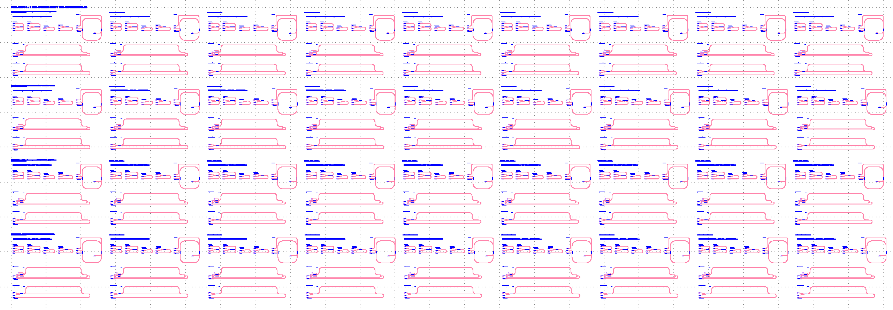

**Figure 17: Final-chip DOE layout for sweeping the beam-splitter coupling length. The array**

contains 4 × 8 master cells. The first two rows correspond to the w = 300 nm design, and the last
two rows correspond to the w = 500 nm design. For each width, the first row is a fine sweep around
the simulated 50/50 length, while the second row is a coarse sweep from the simulated length up
to approximately 1.3Lπ.
Overall, this DOE structure provides both local and global information about the couplinglength dependence of the beam splitter. The fine sweep is used to select the best fabricated 50/50
device, while the coarse sweep verifies the coupling trend over a larger length range and provides a
fabrication-tolerant backup in case the simulated coupling length is shifted.

## Discussion

In this work, the beam-splitter design was developed through a complete workflow starting from
single-waveguide mode analysis, followed by double-waveguide supermode simulations, couplinglength estimation, GDS layout generation, and final-chip test-structure organization. The main
goal was to design compact directional-coupler beam splitters on a 220 nm SOI platform and to
include enough test structures on the final chip to experimentally identify the best 50/50 device
after fabrication.
Several design choices were made to balance compactness, robustness, and measurement practicality. The waveguide widths of 300 nm and 500 nm were selected because they represent two
different coupling regimes. The narrower waveguide has a larger evanescent tail and can therefore
achieve coupling at larger gaps, while the wider waveguide is more strongly confined and is more
compatible with compact routing, but requires smaller gaps to obtain strong coupling. For each design, the coupling gap and coupling length were chosen from the double-waveguide simulations, and
additional length sweeps were included on the final chip to compensate for fabrication uncertainty.
The final layout was organized as a design-of-experiment array. For each selected beam-splitter
design point, seven test structures were generated. These structures allow the same beam splitter
to be measured in direct four-port, reference, cascaded, combiner, and interferometric configurations. This is important because a single transmission measurement is usually not enough to fully
understand the behavior of a fabricated beam splitter. The test structures provide additional information about insertion loss, splitting ratio, routing loss, phase sensitivity, wavelength dependence,
and the effect of cascading.
There are several additional tasks that would make the work more complete, but they were
not finished in the present design cycle. First, a full high-accuracy FDTD simulation of the final

optimized beam splitter should be performed over the complete wavelength range. In this work,
FDTD was mainly used as a quick verification step with reduced accuracy to confirm the general
behavior of the designed 50/50 structure. A more accurate simulation would give a better estimate
of radiation loss, back-reflection, finite-cladding effects, and parasitic scattering.
Second, a more complete EME-based wavelength sweep should be performed for all final design
candidates. The EME method is more efficient than FDTD for long directional-coupler structures
and would allow a fast extraction of the full four-port S-matrix versus wavelength. This would be
useful for evaluating the bandwidth of the 50/50 splitting ratio and the relative phase between the
output ports.
Third, fabrication-aware simulations should be added. In particular, the waveguide width,
coupling gap, sidewall angle, etch depth, and layer thickness should be swept around their nominal
values. This would quantify the sensitivity of the splitting ratio and phase response to fabrication
errors and would make the design more predictive before tape-out.
Fourth, the grating couplers and edge/fiber coupling structures were treated as standard access
components rather than being fully optimized in this workflow. A complete chip-level design would
include simulations or measured calibration structures for the grating couplers, tapers, and routing
waveguides. This would allow the beam-splitter loss to be separated more accurately from the
coupling and routing losses.
Finally, after fabrication, the DOE structures should be measured systematically. The fine
coupling-length sweep should be used to identify the best fabricated 50/50 beam splitter, while
the coarse sweep should be used to extract the experimental coupling period and compare it with
the simulated value. The reference and interferometric structures should then be used to estimate
excess loss, imbalance, wavelength dependence, and phase behavior. These measurements would
provide the final validation of the beam-splitter design and would indicate which geometry should
be used in future integrated photonic circuits.